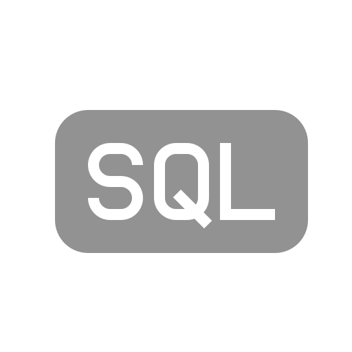

# Lightspin - Home Assignment
## Setup Instructions

## Links

### [Postman file](https://drive.google.com/file/d/1r8ot-y0JG_es0YUk4AOLxqimyWyQ4VOL/view?usp=sharing)
### [Figma file](https://www.figma.com/file/3zCt8gWRKY8xdZwzuFq78l/Lightspin?node-id=8%3A5770&t=JNJP8cbHb5zhbqc9-1)

## Technologies
### Front-end
(TypesScript ,React, Nodejs, Scss, Figma HTML)

### Back-end
(Python, Django, Sqlite, Postman)

### Misc
(Linux-ubuntu, Bash, Git)

